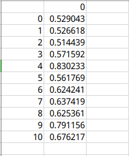
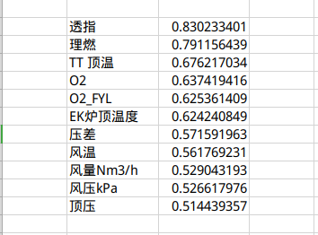

# undergrauduate_project

### 毕设任务

运用支持向量机回归（SVR），预测一氧化碳利用率

### 数据预处理

#### 1. 输入数据的选取

通过采用[灰色关联分析法](https://baike.baidu.com/item/%E7%81%B0%E8%89%B2%E5%85%B3%E8%81%94%E5%88%86%E6%9E%90%E6%B3%95/8602076?fr=aladdin)，分析各个因素对于结果的影响程度，选取影响程度较高的因素作为模型的输入变量。

```python
import numpy as np
import pandas as pd

# 读取为df格式
gray = pd.read_excel(
    "/home/solejay/program/undergrauduate_project/excel/原始数据.xlsx")

# min-max标准化
gray = (gray - gray.min()) / (gray.max() - gray.min())

std = gray.iloc[:, 11]  # 为标准要素
cmp = gray.iloc[:, 0:11]  # 为比较要素

# cmp.shape  tuple (2999, 11)
row = cmp.shape[0]  # 行数
col = cmp.shape[1]  # 列数

# 与标准要素比较，相减
a = np.zeros([col, row])  # 11*2999 矩阵
for i in range(col):
    for j in range(row):
        a[i, j] = abs(cmp.iloc[j, i]-std[j])

# 取出矩阵中最大值与最小值
c = np.amax(a)
d = np.amin(a)

# 计算关联系数
result = np.zeros([col, row])
for i in range(col):
    for j in range(row):
        result[i, j] = (d+0.5*c)/(a[i, j]+0.5*c)

# 求均值，得到灰色关联值
result2 = np.zeros(col)
for i in range(col):
        result2[i] = np.mean(result[i, :])
RT = pd.DataFrame(result2)
RT.to_csv("/home/solejay/program/undergrauduate_project/excel/灰色关联1out.csv")
```

得到的结果如下图所示



经过整理为下图所示



由于被告知透指数有问题，因此不选择透指作为输入变量

#### 2. 缺失值处理

因为所给数据大致经过处理，没有缺失值的情况。因此没有缺失值的处理。

#### 3. 异常值处理

采用拉依达准则法对异常数据进行多次反复剔除。

样本值和平均值的查的绝对值大于三倍的标准差时，将该样本值剔除。

```python
def remove_outlier(x, y):
    mean = np.mean(y)  # 平均值
    std = np.std(y)  # 标准差
    
    lower_limit = mean-3*std  # 最小值
    upper_limit = mean+3*std  # 最大值
    
    for i in range(y.shape[0]):
        if y[i]<lower_limit or y[i]>upper_limit:
            x = x.drop(i)
            y = y.drop(i)
    return x, y
```

#### 4. 数据平滑处理（去噪）

采用小波去噪，小波函数为‘db5’，软阈值处理

```python
def wt(index_list, wavefunc,lv,m,n):   # 打包为函数，方便调节参数。  lv为分解层数；data为最后保存的dataframe便于作图；index_list为待处理序列；wavefunc为选取的小波函数；m,n则选择了进行阈值处理的小波系数层数
   
    # 分解
    coeff = pywt.wavedec(index_list,wavefunc,mode='sym',level=lv)   # 按 level 层分解，使用pywt包进行计算， cAn是尺度系数 cDn为小波系数

    sgn = lambda x: 1 if x > 0 else -1 if x < 0 else 0 # sgn函数

    # 去噪过程
    for i in range(m,n+1):   # 选取小波系数层数为 m~n层，尺度系数不需要处理
        cD = coeff[i]
        for j in range(len(cD)):
            Tr = np.sqrt(2*np.log(len(cD)))  # 计算阈值
            if cD[j] >= Tr:
                coeff[i][j] = sgn(cD[j]) - Tr  # 向零收缩
            else:
                coeff[i][j] = 0   # 低于阈值置零

    # 重构
    return(pywt.waverec(coeff,wavefunc))
```

#### 5. 标准化处理

新数据=（原数据-均值）/标准差

z-score标准化，也称为标准化分数，这种方法根据原始数据的均值和标准差进行标准化，经过处理后的数据符合标准正态分布，即均值为0，标准差为1（根据下面的转化函数很容易证明），转化函数为：


所以说，这种标准化我们称之为归一化的时候，本质上是指将原始数据的标准差映射成1，是标准差归一化。标准差分数可以回答这样一个问题：“给定数据距离其均值多少个标准差”的问题，在均值之上的数据会得到一个正的标准化分数，反之会得到一个负的标准化分数。

```python
x_scaler = StandardScaler()
x_train = x_scaler.fit_transform(x_train)
x_test = x_scaler.transform(x_test)
```

### 代码编写

- 调用库

```python
import pandas as pd  # 读取 excel 文件并对数据进行操作
from sklearn.svm import SVR  # 选择核函数和调整参数
import matplotlib.pyplot as plt  # 画图
import numpy as np  # 数组操作
from sklearn.model_selection import train_test_split  # 将数据划分为训练集和测试集
from sklearn.metrics import mean_squared_error  # 计算 mse
from sklearn.metrics import mean_absolute_error  # 计算 mae
from sklearn.model_selection import GridSearchCV  # 交叉验证选取最佳 SVR 系数
from sklearn.preprocessing import StandardScaler  # z-score 标准化
from sklearn.neural_network import MLPRegressor  # 神经网络回归
```

- 定义函数

```python
# 读取 excel 文件，默认返回第一张表 
# 返回类型：<class 'pandas.core.frame.DataFrame'>
def get_data(file):
    sheet = pd.read_excel(io=file)
    return sheet
```

```python
# 画出预测值和实际值的图像
def plot_graph(svr_model, x_test, y_test):
    sample = [i for i in range(1, len(y_test)+1)]
    sample = np.reshape(sample, (len(sample), 1))
    
    y_pred = svr_model.predict(x_test)

    plt.plot(sample, y_test, color='black', label='真实值')
    plt.plot(sample, y_pred, color='black', marker='p', label='预测值')

    plt.xlabel('样本')
    plt.ylabel('CO利用率 %')
    plt.title('支持向量机回归')
    plt.legend()
    plt.show()
```

- 数据记录

```python
# 输出模型预测率 并写入日志文件
def write_log(svr_model, x_test, y_test, excel_file):
    
    y_pred = svr_model.predict(x_test)
    
    mse = mean_squared_error(y_test, y_pred)
    print('均方误差：%.4f' % mse) 
    
    mae = mean_absolute_error(y_test, y_pred)
    print('平均误差：%.4f' % mae)

    log_file = '/home/solejay/program/undergrauduate_project/log1.txt'
    with open(log_file, 'a') as f:
        s1 = '均方误差：%.4f' % mse + '\n'
        s2 = '平均误差：%.4f' % mae + '\n'
        s3 = '读取文件：' + excel_file.split('/')[-1] + '\n'
        s4 = '模型参数：' + str(svr_model) + '\n'
        s5 = '=============================================================\n'
        s = s1 + s2 + s3 + s4 + s5
        f.write(s)
```

```python
# 神经网络训练
clf = MLPRegressor(solver='lbfgs',random_state=0)
clf.fit(x_train, y_train)

write_log(clf, x_test, y_test, excel_file)
plot_graph(clf, x_test, y_test)
```

```python
# 支持向量机回归
svr_rbf = SVR(kernel='rbf', gamma='auto')
svr_rbf.fit(x_train, y_train)

write_log(svr_rbf, x_test, y_test, excel_file)
plot_graph(svr_rbf, x_test, y_test)
```

### [完整代码](https://github.com/purenjie/undergrauduate_project/blob/master/code/svr.py)


